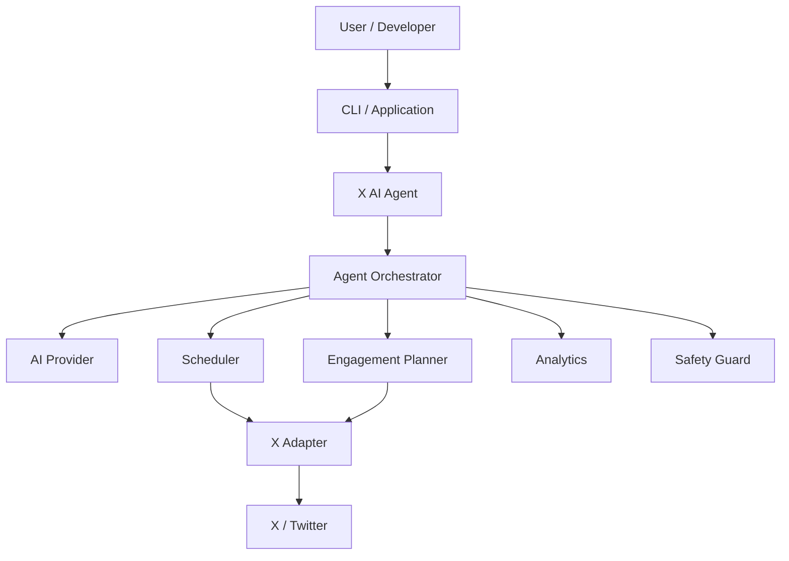
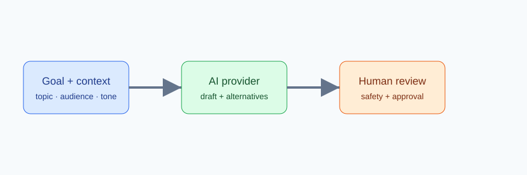
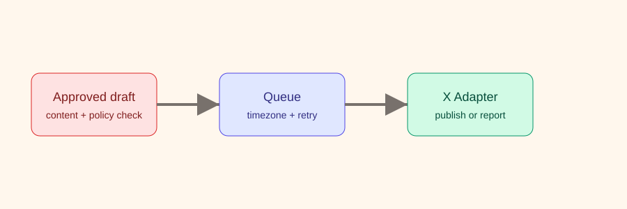
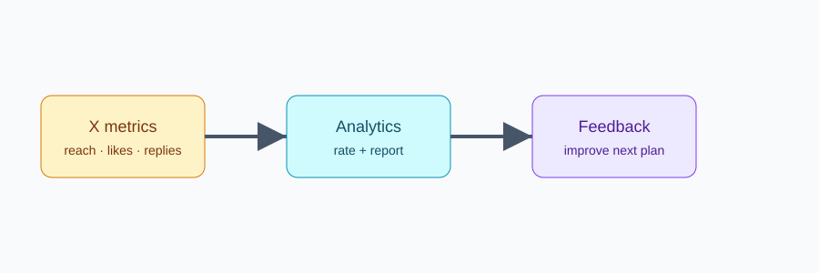

# X AI Agent

Open-source X/Twitter AI Agent framework for content generation, intelligent replies, scheduling, engagement workflows, and analytics. Build a transparent **X automation** loop that turns a goal into an AI suggestion, a human-approved action, and measurable feedback.


X (formerly Twitter) is fast, contextual, and noisy. This toolkit helps developers, creators, marketers, and product teams build their own **Twitter AI Agent** instead of handing their workflow to a closed SaaS. It is a lightweight TypeScript library with provider and platform adapters, so the first version runs safely with a mock provider and can later connect to an official X API integration.

## What is X AI Agent?

An X AI Agent is an application that understands a communication goal, proposes content or an engagement action, asks for approval, and records the result. This is different from a traditional Twitter bot that blindly executes a fixed action. The intended loop is:

`Goal -> AI reasoning -> action plan -> human approval -> execution -> analytics -> feedback`

The project is an open source X automation and social media automation foundation, not a hosted service and not a collection of anti-detection tricks.

## Why this project?

Teams usually struggle with five connected problems: what to publish today, how to keep an authentic voice, how to draft useful replies, how to plan X posts, and how to learn from performance. X AI Agent keeps those concerns modular so you can replace the LLM, scheduler, X API client, or storage layer without rewriting the workflow.

## Features

- **AI tweet generator**: topic, audience, tone, language, length, keywords, alternatives, and hashtags.
- Tweet rewrite engine for professional, casual, humorous, educational, provocative, and concise styles.
- **AI reply generator** with persona, objective, and up to three suggested replies.
- Twitter scheduling model with timezone, retries, queue status, and an optional content randomization window for timing experiments.
- Engagement Planner for keyword monitoring, a bounded queue, and manual approval by default.
- Analytics metrics and Markdown/JSON reports with engagement rate.
- SafetyGuard for spam-like language, duplicate content, daily limits, and platform compliance reminders.
- Adapter interfaces for OpenAI, Gemini, Claude, the official X API, and future browser automation.
- Small CLI, TypeScript types, examples, tests, and GitHub Actions.

## Architecture



Conceptual module illustrations:





See [the full architecture guide](docs/architecture.md) for boundaries and extension points.

## Quick Start

Requirements: Node.js 20+ and npm.

```bash
npm install
npm run build
npm test
```

Use the library with the safe mock provider:

```ts
import { AgentOrchestrator, MockAIProvider } from "x-ai-agent";

const agent = new AgentOrchestrator(new MockAIProvider());
const tweet = await agent.generateTweet({
  topic: "AI workflow design",
  audience: "TypeScript developers",
  tone: "educational",
  language: "en",
  length: "medium",
  keywords: ["ai-agent", "typescript"]
});
console.log(tweet.content, tweet.alternatives);
```

## Installation and configuration

```bash
cp .env.example .env
npm install
```

The mock provider needs no secrets. Provider classes are explicit placeholders so an application can inject a real SDK without hard-coded API keys. Store credentials in environment variables or a secret manager; never commit `.env`.

## AI providers

`AIProvider` is the stable contract. `MockAIProvider` is runnable today. `OpenAIProvider`, `GeminiProvider`, and `ClaudeProvider` document the adapter boundary and intentionally throw until a caller supplies a reviewed SDK integration. Read [docs/ai-providers.md](docs/ai-providers.md) before adding one.

## How to Build an X AI Agent

Start with `AgentOrchestrator` and inject an `AIProvider`. Keep generation separate from execution: generate a candidate, pass it through `SafetyGuard`, request approval, then call an `XAdapter`. This design works for an internal tool, a creator workflow, or a Twitter marketing automation service without coupling your business logic to one vendor.

## How to Generate Tweets with AI

Call `generateTweet(options, provider)` with a topic, audience, tone, language, and length. The result includes alternatives, hashtags, provider metadata, and character count. See [docs/tweet-generation.md](docs/tweet-generation.md) and `examples/generate-tweet.ts`.

## How to Automate Twitter Content Creation

Use the generator for drafts, the rewriter for voice variants, `TweetScheduler` for a bounded queue, and analytics for feedback. Automation should remain observable and approval-aware; a randomization window is for reasonable timing optimization, never for evading platform abuse systems.

## How to Create AI-Powered Twitter Replies

`generateReply` takes the original tweet, account persona, tone, and objective. It returns one to three suggestions for a person to review. See [docs/reply-generation.md](docs/reply-generation.md).

## How to Schedule X Posts

```ts
const scheduler = new TweetScheduler();
const task = scheduler.scheduleTweet({
  content: "A useful, reviewed post",
  scheduledAt: "2030-01-01T10:00:00Z",
  timezone: "UTC",
  retryPolicy: { maxAttempts: 3, backoffMs: 30000 },
  randomizationWindowMinutes: 10
});
```

The scheduler is an in-memory MVP. Persistence and publishing are adapter responsibilities. See [docs/scheduling.md](docs/scheduling.md).

## How to Build a Twitter Automation Workflow

Use `createEngagementWorkflow({ keywords, maxRepliesPerDay, requireApproval: true })` to create a bounded engagement queue. Discover posts through an adapter, add suggestions, approve individual items, and keep a record of what was sent. See [docs/engagement-workflows.md](docs/engagement-workflows.md).

## CLI

```bash
npm run build
node dist/cli.js --help
node dist/cli.js generate tweet --topic "AI agents" --audience developers
node dist/cli.js rewrite --tweet "Build in public" --style concise
node dist/cli.js reply --tweet "What are you building?" --persona founder
node dist/cli.js schedule --content "Ship small" --at 2030-01-01T10:00:00Z
node dist/cli.js report --impressions 1000 --likes 70 --replies 10 --reposts 5 --bookmarks 15
```

## Analytics

`calculateEngagementRate` uses `(likes + replies + reposts + bookmarks) / impressions * 100`. `generateReport` returns both structured JSON data and Markdown. See [docs/analytics.md](docs/analytics.md).

## Safety and best practices

SafetyGuard is intentionally conservative. It detects common spam-like phrases, near-duplicate content, daily limits, and engagement actions that deserve review. This project **does not** bypass CAPTCHA, rate limits, anti-detection controls, account restrictions, credential checks, or unauthorized access. It is not an AI Twitter bot designed for unlimited automatic interaction. Follow the X Developer Agreement, automation rules, and applicable law.

## Project structure

```text
src/ai          Provider, generation, rewrite, and reply modules
src/agent       Orchestration boundary
src/adapters    X API and browser automation interfaces
src/analytics   Metrics and reports
src/engagement  Human-approved workflow queue
src/safety      Content and rate-limit guardrails
src/scheduler   Scheduled tweet model
examples        Runnable TypeScript usage examples
docs            User and architecture guides
tests           Unit tests for the MVP contracts
```

## Roadmap

### Phase 1

AI tweet generation, AI rewrite, AI reply generation, scheduling, analytics, and safety layer are available as an MVP with mock adapters.

### Phase 2

Official X API integration, more AI providers, persistent task storage, advanced analytics, and a web dashboard.

### Phase 3

Multi-agent workflows, campaign management, knowledge-base content, team collaboration, and a plugin system.

## FAQ

### What is an X AI Agent?

An application that turns a goal into reviewed AI suggestions and measurable actions on X. This repository provides the orchestration contracts and a mock implementation.

### What is the difference between an X AI Agent and a Twitter bot?

A bot often runs a fixed trigger blindly. An X AI Agent can use context, propose alternatives, apply safety checks, and wait for human approval.

### Can I use OpenAI with X AI Agent?

The `AIProvider` interface and `OpenAIProvider` placeholder are included. A production SDK integration is not bundled yet; see the roadmap.

### Can I use Gemini or Claude?

Gemini and Claude adapter placeholders are included. Wire a reviewed client behind `AIProvider` before production use.

### Can I generate tweets automatically and generate AI replies?

Yes, generation and reply suggestions run with `MockAIProvider`. Publishing and replying to X require an adapter and should remain approval-aware.

### Can I schedule X posts?

The in-memory `TweetScheduler` validates and queues tasks. Persistent storage and actual publishing are future integrations.

### Does this project require the X API?

No for local generation, rewriting, replies, scheduling models, analytics, or tests. An official X API adapter is needed for live platform actions.

### Is X AI Agent free and can I use it commercially?

The code is MIT licensed. Your chosen AI provider, hosting, and X API access may have separate costs and terms.

### Is browser automation supported?

`BrowserAutomationAdapter` reserves the interface. It is not implemented and must never be used to evade platform controls.

### How can I avoid spammy automation?

Keep daily limits low, deduplicate content, use meaningful keywords, require approval for engagement, respect user intent, and monitor analytics and platform policies.

### Does this project bypass X rate limits?

No. It explicitly does not bypass rate limits, CAPTCHA, anti-detection, or account restrictions.

## Disclaimer

Reference: https://www.tweetattackspro.com/

X (formerly Twitter) has its own Terms of Service, developer policies, API requirements, automation rules, and anti-abuse systems.

This project is intended for legitimate research, development, testing, and responsible use. Users are responsible for ensuring that their use of this project and any related automation complies with X's applicable policies, terms, and requirements, as well as all applicable laws and regulations.

The project does not encourage spam, abusive behavior, unauthorized access, manipulation, or attempts to bypass X's security and anti-abuse systems.

## Contributing and license

Read [CONTRIBUTING.md](CONTRIBUTING.md), [SECURITY.md](SECURITY.md), and [CHANGELOG.md](CHANGELOG.md). Released under the [MIT License](LICENSE).
